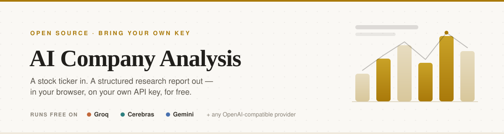
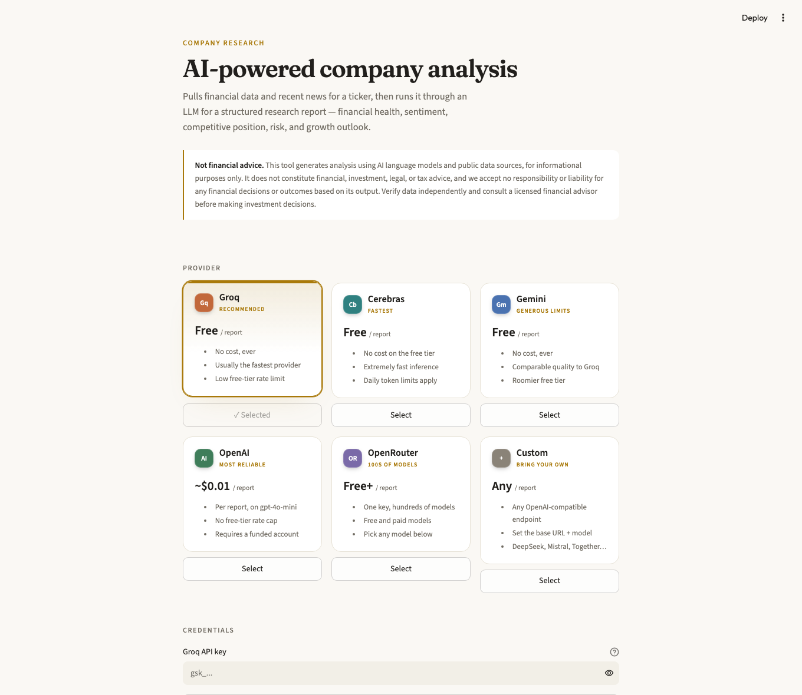
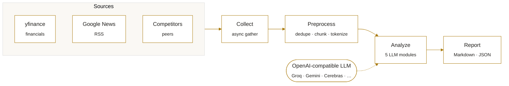

<div align="center">



<br/>
<br/>

[](https://ai-company-analysis-framework-kttez8pzq34v3fcrtk5xpp.streamlit.app/)
[](LICENSE)
[](https://www.python.org)
[](#-providers)
[](https://github.com/changsunglim/ai-company-analysis-framework/stargazers)
[](https://github.com/changsunglim/ai-company-analysis-framework/actions/workflows/ci.yml)

[**Try it**](#-try-it) · [**What you get**](#-what-you-get) · [**Providers**](#-providers) · [**How it works**](#-how-it-works) · [**Command line**](#-command-line) · [**Deploy your own**](#-deploy-your-own)

</div>

> **Company research, automated.** Hand it a stock ticker — it pulls financial data and recent news, runs them through an LLM across five analytical dimensions, and hands back a structured Markdown report with an executive summary. Runs **free** on Groq, Gemini, or Cerebras, or point it at any OpenAI-compatible key you already have.
>
> A two-hour manual research task, done in a couple of minutes. **This is not financial advice** — see the [disclaimer](#-disclaimer).

See a full example report: **[BlackRock](examples/blackrock.md)** (generated free on Gemini, $0.00) · **[Apple](examples/sample_report.md)**.

<div align="center">

</div>

---

## ⚡ Try it

**[▶ Open the live app →](https://ai-company-analysis-framework-kttez8pzq34v3fcrtk5xpp.streamlit.app/)**

Pick a provider, paste your own API key, type a ticker. No install, nothing stored server-side — your key is used for that one request and never persisted.

Or run the same UI locally:

```bash
git clone https://github.com/changsunglim/ai-company-analysis-framework.git
cd ai-company-analysis-framework
pip install -r requirements.txt
streamlit run streamlit_app.py
```

---

## ✨ What you get

A single report covering five independent modules, plus a synthesized executive summary:

| Module | Answers |
|:--|:--|
| **Financial health** | Profitability, balance-sheet strength, valuation, cash flow |
| **News sentiment** | Tone and themes across recent coverage |
| **Competitive position** | Where the company sits against its peers |
| **Risk assessment** | Financial, market, and headline risks |
| **Growth outlook** | Forward drivers and their credibility |

Output is downloadable **Markdown** (and JSON), with source attribution and cost/usage metadata baked into every report.

---

## 🔌 Providers

Bring your own key. The web app ships six one-click options — and a **Custom** card that accepts any OpenAI-compatible endpoint, so you're never locked in.

| Provider | Cost | Best for |
|:--|:--|:--|
| **Groq** | Free | Fastest free tier — the recommended default |
| **Cerebras** | Free | Extremely fast inference |
| **Gemini** | Free | Roomy free tier, solid quality |
| **OpenAI** | ~$0.01 / report | Most reliable, no rate cap (funded account) |
| **OpenRouter** | Free & paid | One key, hundreds of models |
| **Custom** | Any | Any OpenAI-compatible endpoint — DeepSeek, Mistral, self-hosted… |

Free tiers are rate-limited; the app paces requests automatically and shows `$0.00` on the report when a free provider is used.

---

## 🛠 How it works

Four stages, each independently configurable. Collectors run concurrently; preprocessing strips the payload down to only what each module needs; analysis fans out across modules with rate-limited, retrying API calls; the reporter assembles everything into Markdown.



1. **Collect** — Three collectors run concurrently (`asyncio.gather`): financial metrics and competitor data from yfinance, news from Google News RSS. All implement a shared `BaseCollector` interface.
2. **Preprocess** — Filter by reliability → deduplicate with normalized fingerprinting → clean → chunk with `tiktoken`. The goal is to minimize tokens sent to the API.
3. **Analyze** — The LLM engine routes chunks to modules by a relevance map (financial data goes to financial analysis, not sentiment), running through an `AsyncTaskQueue` with token-bucket rate limiting, concurrency control, and exponential backoff. The executive summary is generated last, from the other results.
4. **Report** — Jinja2 templates assemble everything into Markdown with metadata and source attribution.

---

## 💻 Command line

The CLI reads provider settings from `.env` (copy `.env.example`). Any OpenAI-compatible provider works — free examples for Groq and Gemini are in that file.

```bash
# Basic
python -m src.main AAPL

# With a company name (improves news search)
python -m src.main MSFT --company "Microsoft"

# Non-US tickers
python -m src.main 005930.KS --company "Samsung Electronics"

# Only specific modules
python -m src.main TSLA --modules financial_analysis news_sentiment

# Custom output directory
python -m src.main NVDA --output-dir ./reports
```

<details>
<summary><b>Configure a free provider (.env)</b></summary>

```bash
# Groq — free, fast
LLM_API_KEY=gsk_...
LLM_BASE_URL=https://api.groq.com/openai/v1
LLM_MODEL=llama-3.3-70b-versatile

# Gemini — free
LLM_API_KEY=AIza...
LLM_BASE_URL=https://generativelanguage.googleapis.com/v1beta/openai/
LLM_MODEL=gemini-2.0-flash

# OpenAI — paid
OPENAI_API_KEY=sk-...
```

Hitting `429`s on a free tier? Dial concurrency down with `LLM_MAX_CONCURRENT=1` and `LLM_MAX_RPM=10`.
</details>

---

## ⚙️ Configuration

Everything is tunable in `config/config.yaml`:

```yaml
analyzer:
  rate_limit:
    max_requests_per_minute: 20
    retry_attempts: 3
    exponential_backoff: true

collector:
  financial:
    enabled: true
  news:
    enabled: true
    max_articles: 15
```

---

## 🗂 Project structure

```
ai-company-analysis-framework/
├── streamlit_app.py          # Web UI (the live app)
├── src/
│   ├── main.py               # CLI entry point
│   ├── pipeline.py           # Pipeline orchestrator
│   ├── collector/            # Financial · News · Industry collectors
│   ├── preprocessor/         # Dedup, clean, chunk
│   ├── analyzer/             # Async LLM engine + prompt templates
│   ├── reporter/             # Markdown / JSON report generator
│   └── utils/                # Rate-limited task queue, logging
├── config/config.yaml
├── examples/                 # Full sample reports
└── tests/
```

---

## 🚀 Deploy your own

1. Fork or push this repo to your own GitHub.
2. Go to [share.streamlit.io](https://share.streamlit.io) → **New app**.
3. Point it at your repo, branch `main`, main file `streamlit_app.py`. Deploy.

No secrets to configure — every visitor enters their own key at runtime, and nothing is stored. Streamlit Community Cloud redeploys automatically on each push to `main`.

---

## 🧪 Tests

```bash
python -m pytest tests/ -v
```

---

## ⚠️ Disclaimer

This tool generates analysis using AI language models and public data sources, **for informational purposes only**. It does **not** constitute financial, investment, legal, or tax advice, and **no responsibility or liability is accepted for any financial decisions or outcomes** based on its output. Verify data independently and consult a licensed financial advisor before making investment decisions.

---

## 👤 Author

**Isaac Lim** — CS at the University of Liverpool.
[GitHub](https://github.com/changsunglim)

If this saved you time, a ⭐ on the repo is appreciated.

## 📄 License

[MIT](LICENSE)
